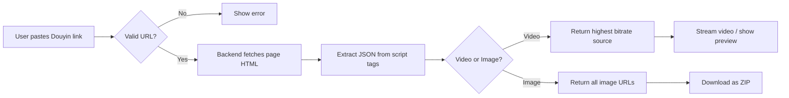

<div align="center">


<a href="https://github.com/KkOma-value/image-video/stargazers"></a>
<a href="https://github.com/KkOma-value/image-video/network/members"></a>
<a href="https://github.com/KkOma-value/image-video/issues"></a>
<a href="https://github.com/KkOma-value/image-video/blob/main/LICENSE"></a>

<br>


</div>

<br>

## Features

<table>
<tr>
<td width="50%">

### Single Parse
Paste one share link, preview the video/image, and download the original without watermark.

</td>
<td width="50%">

### Batch Parse
Paste up to **20 links** at once, parse them all in one go. Perfect for bulk downloading.

</td>
</tr>
<tr>
<td width="50%">

### Video Support
Extracts the highest bitrate source available. Cover preview, author info, and interaction stats included.

</td>
<td width="50%">

### Image Support
Handles image-type posts (slideshows) — downloads all images as a ZIP archive.

</td>
</tr>
</table>

<br>

## Tech Stack

<div align="center">

<table>
<tr>
<td align="center"><strong>Frontend</strong></td>
<td align="center"><strong>Backend</strong></td>
</tr>
<tr>
<td>

| Layer | Choice |
|-------|--------|
| Framework | React 19 |
| Language | TypeScript 6 |
| Build Tool | Vite 8 |
| Styling | Tailwind CSS 4 |
| Icons | Lucide React |
| HTTP Client | Axios |

</td>
<td>

| Layer | Choice |
|-------|--------|
| Framework | FastAPI |
| Language | Python 3.13 |
| Validation | Pydantic |
| HTTP Client | httpx |
| Rate Limiting | In-memory middleware |
| CORS | Configurable via env |

</td>
</tr>
</table>

</div>

<br>

## Quick Start

### Backend

```bash
cd backend

# Install dependencies
pip install -r requirements.txt

# Start the server (default: http://localhost:8000)
python main.py
```

### Frontend

```bash
cd frontend

# Install dependencies
npm install

# Start dev server (default: http://localhost:5173)
npm run dev
```

<br>

## API Reference

All endpoints are prefixed with `/api/v1`.

| Method | Endpoint | Description |
|--------|----------|-------------|
| `POST` | `/parse` | Parse a single Douyin URL |
| `POST` | `/download` | Parse and stream the file (video/mp4 or zip) |
| `POST` | `/parse/batch` | Parse up to 20 URLs at once |

### Request Body

```json
{
  "url": "https://v.douyin.com/xxxxx/",
  "download_type": "video"
}
```

### Response

```json
{
  "success": true,
  "data": {
    "type": "video",
    "aweme_id": "7300000000000000000",
    "desc": "Video description here",
    "video_url": "https://...",
    "cover_url": "https://...",
    "author": {
      "nickname": "Author",
      "unique_id": "author_id",
      "avatar_url": "https://..."
    },
    "stats": {
      "digg_count": 12000,
      "comment_count": 340,
      "share_count": 56,
      "collect_count": 890
    }
  }
}
```

<br>

## Project Structure

```
image-video/
├── backend/
│   ├── main.py                 # FastAPI app entry, CORS, rate limiter
│   ├── models/
│   │   └── schemas.py          # Pydantic models & error codes
│   ├── routers/
│   │   └── api.py              # API endpoints
│   ├── services/
│   │   ├── douyin_parser.py    # Core parsing logic
│   │   └── downloader.py       # Video/image download service
│   └── utils/
│       └── http_client.py      # Shared httpx client
│
├── frontend/
│   ├── src/
│   │   ├── App.tsx             # Main app with single/batch modes
│   │   ├── components/
│   │   │   ├── UrlInput.tsx    # URL input with paste detection
│   │   │   ├── BatchInput.tsx  # Multi-URL textarea
│   │   │   ├── ParseResult.tsx # Result display card
│   │   │   ├── VideoPreview.tsx
│   │   │   ├── ImageGallery.tsx
│   │   │   ├── DownloadButton.tsx
│   │   │   └── Footer.tsx
│   │   ├── hooks/
│   │   │   └── useDouyinParser.ts
│   │   ├── types/
│   │   │   └── index.ts
│   │   └── utils/
│   │       └── api.ts          # Axios API layer
│   ├── package.json
│   └── vite.config.ts
│
└── README.md
```

<br>

## How It Works



<br>

## Environment Variables

| Variable | Default | Description |
|----------|---------|-------------|
| `CORS_ORIGINS` | `http://localhost:5173` | Comma-separated allowed origins |

<br>

## Contributing

1. Fork this repository
2. Create your feature branch (`git checkout -b feature/amazing-feature`)
3. Commit your changes (`git commit -m 'feat: add amazing feature'`)
4. Push to the branch (`git push origin feature/amazing-feature`)
5. Open a Pull Request

<br>

## License

This project is licensed under the MIT License — see the [LICENSE](LICENSE) file for details.

<br>

<div align="center">


</div>
